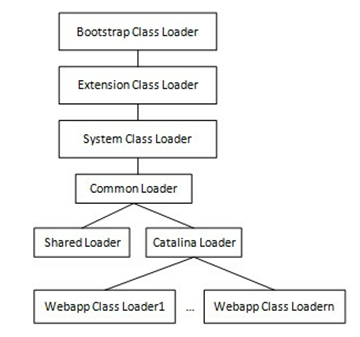

Tomcat 8.5.11类加载部分源码阅读

# 启动

Tomcat的启动入口位于org.apache.catalina.startup.Bootstrap，其main方法调用了init方法:

```java
public void init() throws Exception {
	initClassLoaders();
	Thread.currentThread().setContextClassLoader(catalinaLoader);
	SecurityClassLoad.securityClassLoad(catalinaLoader);
	// Load our startup class and call its process() method
	if (log.isDebugEnabled())
		log.debug("Loading startup class");
		Class<?> startupClass =catalinaLoader.loadClass("org.apache.catalina.startup.Catalina");
        Object startupInstance = startupClass.newInstance();\
        // Set the shared extensions class loader
        if (log.isDebugEnabled())
            log.debug("Setting startup class properties");
        String methodName = "setParentClassLoader";
        Class<?> paramTypes[] = new Class[1];
        paramTypes[0] = Class.forName("java.lang.ClassLoader");
        Object paramValues[] = new Object[1];
        paramValues[0] = sharedLoader;
        Method method =
            startupInstance.getClass().getMethod(methodName, paramTypes);
        method.invoke(startupInstance, paramValues);
        catalinaDaemon = startupInstance;
}
```

# 类加载器初始化

initClassLoaders:

```java
private void initClassLoaders() {
	try {
		commonLoader = createClassLoader("common", null);
		if( commonLoader == null ) {
			// no config file, default to this loader - we might be in a 'single' env.
			commonLoader=this.getClass().getClassLoader();
		}
		catalinaLoader = createClassLoader("server", commonLoader);
		sharedLoader = createClassLoader("shared", commonLoader);
	} catch (Throwable t) {
		handleThrowable(t);
		log.error("Class loader creation threw exception", t);
		System.exit(1);
	}
}
```

在开始之前，先说明一下Tomcat整体的类加载器结构:



可以看出，**对于每一个web app，tomcat都使用单独的类加载器进行加载，这样可以保证app之间不相互干扰，IDE的插件体系其实也是这个思路**。

关于这样做之后更深层次的效果参见:

[Just How Tomcat Classloader separate different Webapps object scope in same JVM?](http://stackoverflow.com/questions/19559210/just-how-tomcat-classloader-separate-different-webapps-object-scope-in-same-jvm)

显然，逻辑的核心在createClassLoader方法:

```java
private ClassLoader createClassLoader(String name, ClassLoader parent) throws Exception {
	String value = CatalinaProperties.getProperty(name + ".loader");
	if ((value == null) || (value.equals("")))
		return parent;
	value = replace(value);
	List<Repository> repositories = new ArrayList<>();
	String[] repositoryPaths = getPaths(value);
	for (String repository : repositoryPaths) {
		// Check for a JAR URL repository
		try {
			@SuppressWarnings("unused")
			URL url = new URL(repository);
			repositories.add(
					new Repository(repository, RepositoryType.URL));
			continue;
		} catch (MalformedURLException e) {
			// Ignore
		}
		// Local repository
		if (repository.endsWith("*.jar")) {
			repository = repository.substring
				(0, repository.length() - "*.jar".length());
			repositories.add(
					new Repository(repository, RepositoryType.GLOB));
		} else if (repository.endsWith(".jar")) {
			repositories.add(
					new Repository(repository, RepositoryType.JAR));
		} else {
			repositories.add(
					new Repository(repository, RepositoryType.DIR));
		}
	}
	return ClassLoaderFactory.createClassLoader(repositories, parent);
}
```

以下进行分部分说明。