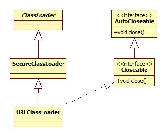

# 类加载器初始化

Tomcat的启动入口位于org.apache.catalina.startup.Bootstrap，其main方法调用了init方法:

```java
public void init() throws Exception {
	initClassLoaders();
	Thread.currentThread().setContextClassLoader(catalinaLoader);
	SecurityClassLoad.securityClassLoad(catalinaLoader);
	// Load our startup class and call its process() method
	Class<?> startupClass =catalinaLoader.loadClass("org.apache.catalina.startup.Catalina");
	Object startupInstance = startupClass.newInstance();\
	// Set the shared extensions class loader
	String methodName = "setParentClassLoader";
    Class<?> paramTypes[] = new Class[1];
    paramTypes[0] = Class.forName("java.lang.ClassLoader");
    Object paramValues[] = new Object[1];
    paramValues[0] = sharedLoader;
    Method method =
    	startupInstance.getClass().getMethod(methodName, paramTypes);
	method.invoke(startupInstance, paramValues);
    catalinaDaemon = startupInstance;
}
```

initClassLoaders:

```java
private void initClassLoaders() {
	commonLoader = createClassLoader("common", null);
	if( commonLoader == null ) {
		// no config file, default to this loader - we might be in a 'single' env.
		commonLoader=this.getClass().getClassLoader();
	}
	catalinaLoader = createClassLoader("server", commonLoader);
	sharedLoader = createClassLoader("shared", commonLoader);
}
```

在开始之前，先说明一下Tomcat整体的类加载器结构:


可以看出，**对于每一个web app，tomcat都使用单独的类加载器进行加载，这样可以保证app之间不相互干扰，IDE的插件体系其实也是这个思路**。

关于这样做之后更深层次的效果参见:

[Just How Tomcat Classloader separate different Webapps object scope in same JVM?](http://stackoverflow.com/questions/19559210/just-how-tomcat-classloader-separate-different-webapps-object-scope-in-same-jvm)

显然，逻辑的核心在createClassLoader方法:

```java
private ClassLoader createClassLoader(String name, ClassLoader parent) throws Exception {
	String value = CatalinaProperties.getProperty(name + ".loader");
	if ((value == null) || (value.equals("")))
		return parent;
	value = replace(value);
	List<Repository> repositories = new ArrayList<>();
	String[] repositoryPaths = getPaths(value);
	for (String repository : repositoryPaths) {
		// Local repository
		if (repository.endsWith("*.jar")) {
			repository = repository.substring(0, repository.length() - "*.jar".length());
			repositories.add(new Repository(repository, RepositoryType.GLOB));
		} else if (repository.endsWith(".jar")) {
			repositories.add(new Repository(repository, RepositoryType.JAR));
		} else {
			repositories.add(new Repository(repository, RepositoryType.DIR));
		}
	}
	return ClassLoaderFactory.createClassLoader(repositories, parent);
}
```

以下进行分部分说明。

## 配置读取

Tomcat使用配置文件**catalina.properties**来确定每个类加载器负责加载的路径/jar包。CatalinaProperties类负责此配置的读取，源码不再贴出，只说明一下查找此配置的路径顺序:

- 如果设置了环境变量catalina.config，那么去其指定的位置查找
- 去tomcat的conf目录下查找，一般都是走的这一步
- 去包/org/apache/catalina/startup/下查找

我们以CommonLoader为例，相关配置如下:

```properties
common.loader="${catalina.base}/lib","${catalina.base}/lib/*.jar","${catalina.home}/lib","${catalina.home}/lib/*.jar"
```

replace方法负责占位符的替换。

## 加载器创建

逻辑在于ClassLoaderFactory.createClassLoader方法:

将路径转换为URL，并构造一个URLClassLoader对象返回。所以Tomcat的类加载器其实都是URLClassLoader实例。其类图:



## 加载范围

我们来看一下每个加载器负责的范围。

### CommonClassLoader

在配置读取一节中我们已经见过common.loader的内容了。结合debug可以证实，其负责的就是Tomcat目录下的lib文件夹。

### ServerClassLoader

配置:

```properties
server.loader=
```

结合注释可以发现，如果此处值为空，那么使用CommonClassLoader作为ServerClassLoader。

### SharedClassLoader

配置:

```properties
shared.loader=
```

处理方式同上。

# Tomcat启动

启动其实就是对Catalina的load和start方法的先后反射调用。

